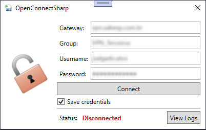

# OpenConnectSharp

A windows-only alternative client for Cisco's AnyConnect VPN protocol based on [OpenConnect](https://www.infradead.org/openconnect/).

# Features

- An easy drop-in solution for OpenConnect GUI Windows users running exclusively on Cisco's AnyConnect protocol. This should prevent issues with user agent validation related [here](https://gitlab.com/openconnect/openconnect-gui/-/issues/331) and [here](https://gitlab.com/openconnect/openconnect-gui/-/issues/271).
- Modern and simple .NET 7 based WPF application with a relatively low memory footprint.
- Automatic management of Windows power events preventing disconnections whenever the computer sleeps or hibernates.

# Instalation

1. Install OpenConnect CLI from the [official repository](https://www.infradead.org/openconnect/) . Don't forget to add it to the PATH.
2. Copy [this script](https://github.com/teofilosalgado/OpenConnectSharp/blob/master/OpenConnectSharp.UI/Resources/vpnc-script-win.js) to your OpenConnect installation folder root (usually `C:\Program Files\OpenConnect`). Replace it if necessary.
3. Download the latest release from [this link](https://github.com/teofilosalgado/OpenConnectSharp/releases/latest/download/release.zip) and extract it.
4. Run `OpenConnectSharp.UI.exe` as administrator.
5. Profit!

# Usage

